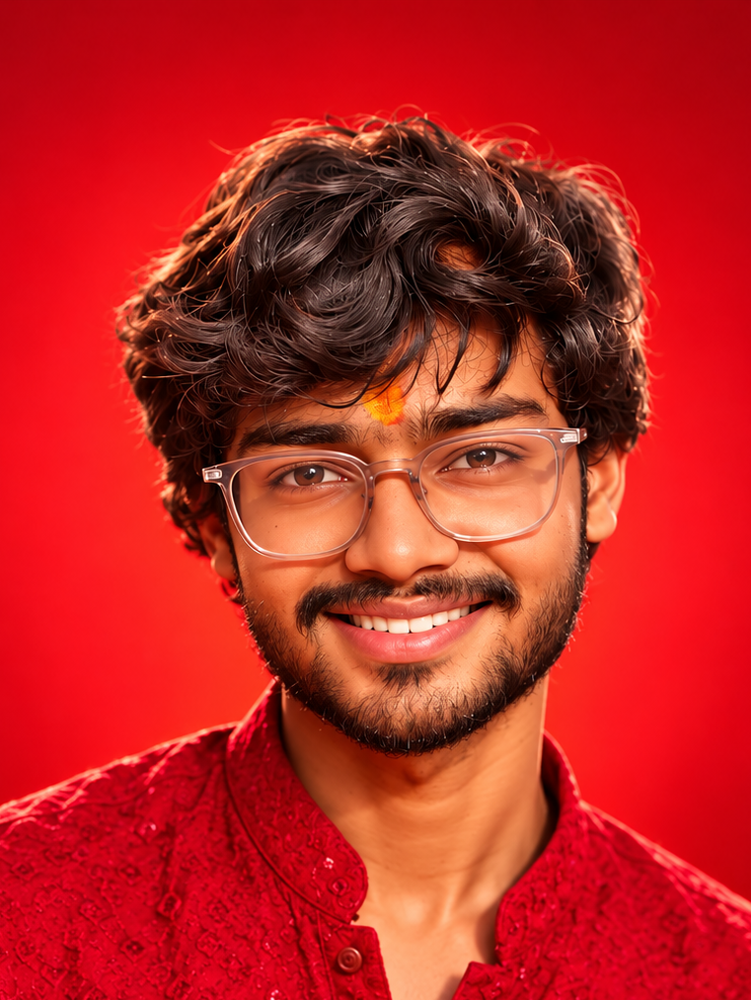

# 🚀 Kartik R N Gupta — Interactive Technical Portfolio

A modern, high-performance developer portfolio built with **React 18** and **Vite**, featuring an interactive 60 FPS cursor-tracking character canvas, comprehensive technical project showcases with deep-dive modals, and a dedicated pixel-perfect About page.



---

## ✨ Features & Architecture

### 1. 🎯 Interactive 60 FPS Cursor-Tracking Hero
- **Zero-Lag Frame Playback**: Directional head & eye rotation rendered via high-performance HTML5 Canvas and 128 pre-rendered WebP frames.
- **No Video Seeking**: Avoids runtime `<video>` seeking bottlenecks by utilizing an in-memory frame cache with progressive decoding.
- **Hardware-Accelerated Interpolation**: Smooth cursor angle tracking with normalized circular trigonometry and `requestAnimationFrame`.
- **Center Idle State**: Seamless transition to a forward-facing idle frame when mouse exits the viewport or remains centered.

### 2. 💎 Pixel-Perfect Dedicated About Page (`/about`)
- **Orbital Ring Portrait**: Custom-styled hero showcase with smooth orbital glow effects and responsive typography.
- **Horizontal Journey Timeline**: Milestone progression highlighting key educational achievements, hackathons, and software engineering experience.
- **Core Principles & Focus**: Cards detailing engineering philosophy, system architecture focus, and design aesthetics.
- **Photography Mosaic**: Responsive high-resolution gallery celebrating street, nature, and architectural photography.

### 3. 🛠️ Technical Portfolio Sections
- **Technical Arsenal**: Categorized skills covering AI/ML, Web Systems, Languages, and DevOps.
- **Featured Projects**: Full case study modal overlays featuring system architecture details, engineering challenges, and tech stack tags.
- **Resume Modal**: Interactive in-browser curriculum vitae viewer with clean download options.
- **Responsive Layout**: Designed mobile-first with touch-friendly interactions and zero horizontal overflow.

---

## 💻 Tech Stack

- **Frontend Core**: React 18, Vite
- **Styling**: Pure Modern CSS with custom design tokens & CSS variables
- **Icons**: Lucide React + custom inline SVGs
- **Typography**: Space Grotesk, Inter, DM Mono, Caveat
- **Processing Tools**: Python, OpenCV (cv2) for frame extraction and resolution optimization

---

## 📁 Project Structure

```text
Kartik-Portfolio/
├── public/
│   ├── about/            # Optimized visual assets for the /about route
│   ├── frames/           # 128 WebP directional frames for cursor tracking
│   ├── character1.mp4    # Master character animation source
│   └── character.png     # Fallback character poster
├── scripts/
│   ├── extract_new_frames.py  # Python OpenCV frame extraction pipeline
│   ├── optimize_frames.py     # Lossless WebP optimizer
│   └── tools/                 # Angle and color analysis utilities
├── src/
│   ├── components/
│   │   ├── AboutPage.jsx          # Dedicated /about route component
│   │   ├── AboutSection.jsx       # Homepage summary section
│   │   ├── CharacterTracker.jsx   # 60 FPS Canvas frame renderer
│   │   ├── ContactSection.jsx     # Contact channels & direct outreach
│   │   ├── CurrentlyLearning.jsx  # Active tech learning tracks
│   │   ├── CustomCursor.jsx       # Smooth hardware-accelerated cursor
│   │   ├── EducationSection.jsx   # Academic background & coursework
│   │   ├── Footer.jsx             # Social links & footer
│   │   ├── HeroContent.jsx        # Hero text overlay & CTA triggers
│   │   ├── Icons.jsx              # Reusable SVG brand icons
│   │   ├── JourneySection.jsx     # Career & hackathon milestones
│   │   ├── Navbar.jsx             # Dual-route navigation header
│   │   ├── PhotographySection.jsx # Creative photography mosaic
│   │   ├── ProjectModal.jsx       # Case study detailed modal
│   │   ├── ProjectsSection.jsx    # Project grid with filter tags
│   │   ├── ResumeModal.jsx        # In-browser CV viewer
│   │   └── SkillsSection.jsx      # Technical skills matrix
│   ├── App.jsx           # Main routing & state controller
│   ├── index.css         # Global design system & theme variables
│   └── main.jsx          # Application root
├── index.html            # Entry HTML & Google Fonts
├── package.json
└── vite.config.js
```

---

## 🚀 Getting Started

### Prerequisites
- **Node.js** (v18.0.0 or higher recommended)
- **npm** or **yarn** / **pnpm**

### Installation

1. **Clone the repository:**
   ```bash
   git clone https://github.com/kartikrngupta/portfolio.git
   cd portfolio
   ```

2. **Install dependencies:**
   ```bash
   npm install
   ```

3. **Start local development server:**
   ```bash
   npm run dev
   ```
   Open [http://localhost:5173](http://localhost:5173) in your browser.

4. **Build for production:**
   ```bash
   npm run build
   ```

5. **Preview production build:**
   ```bash
   npm run preview
   ```

---

## 🔒 Security & Quality Assurance

- Strict `.gitignore` configuration ensuring zero exposure of keys, credentials, or development cache files.
- Zero external runtime analytics or insecure scripts.
- Highly optimized static bundle with lazy-loaded modal states and progressive image decodes.

---

## 📄 License

This project is licensed under the [MIT License](LICENSE).
